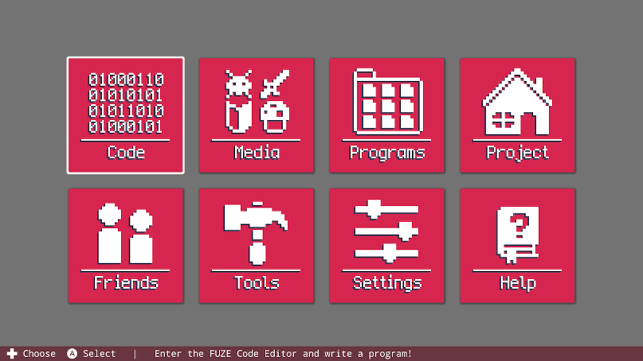

# 使用FUZE

当你第一次使用Fuze 4 Nintendo Switch, 你首先会看到就是下面这个欢迎界面：

从这里你能够访问FUZE能够提供的所有功能。

# 命令条（Command Bar）

在我们去浏览每个菜单的项目之前，让我们先看一下屏幕的底部：

这个命令条会一直出现在屏幕的底部，通过这个命令条，我们能够清晰地知道当前我们能够访问的所有控制命令。

如果当你不知道能够进行什么控制，可以看一下这个命令条获得指导。

# 代码（Code）

当光标选中“Code”按钮，并按下Joy-Con上的A键（或者按下USB键盘上的回车键），我们就会进入到代码编辑器界面。

你将会在代码编辑器中花费你使用FUZE的大部分时间，这里是我们写代码的地方。从代码编辑器界面，你也可以访问资源浏览器加载素材，或者在编辑器界面直接查看教程。

# 素材（Media）

选中“Media”并按下A键，就会进入素材浏览器。

从这里你能够浏览并使用大量的图片以及声音素材。甚至会让你眼花缭乱。

# 程序（Programs）

选择“Programs”按钮按A键，你能够查看随现在FUZE内所有存在的程序。可以加载或分享随游戏安装的和你自己创建的程序，如果你有创建的话。

# 项目（Project）

这个界面我们能够查看目前打开的项目的详细信息。同时你能够修改这些信息，或者在这里新建项目。

# 好友（Friends）

在这里会显示你所有的Siwtch好友，如果他们也拥有Fuze 4 Nintento Switch，那么你就能够下载他们分享的程序。

# 工具（Tools）

如果你想用已经存在的素材来创建自己的关卡，或者是自己创建自己的素材，不管是哪一项，你都能在这里找到你需要的。

在这里你能够选择地图或者图片编辑器，使用地图编辑器来使用已经存在的素材来创建关卡，使用图片编辑器来创建你自己的素材。

**NODE:**使用这两个编辑器创建的地图和图片都会存储到**一个具体的项目**,在你每一次打开这两个编辑器的时候，你都会被要求选择一个项目。

# 设定（Settings）

正如你想的，“Settings”按钮将会导向Fuze 4 Nintendo Switch的设置页面。在这里你能随心调整内容，改变外观以及应用程序的行为。
