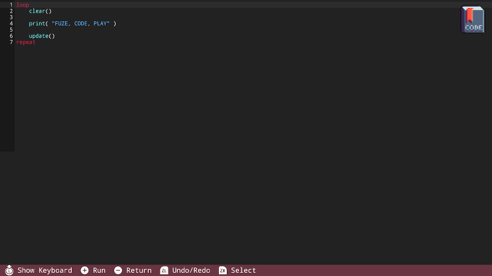

# 代码编辑器

要进入代码编辑器，在主界面选择“Code”按钮。它看起来是这样的：

先看一下在屏幕底部的命令条，上面列出了你在这个界面能够运行的一些指令。

按下“+”号按钮去**运行**程序，按下“-”号按钮可以回到主界面。

# 屏幕键盘

按下左摇杆按钮可以打开屏幕键盘。

看一下命令条，你会看到已经改变了，现在显示的是利用键盘能够进行的操作。记得参考一下命令条，如果你不确定如何控制FUZE！

在打开屏幕键盘的时候，拉动左摇杆能够让你选择要输入的按键，按下A进行输入。

如果你像浏览素材，那么按下屏幕键盘上的“Media”按钮能够快速方便地打开素材浏览器。

相似的，按下“Help”键可以在编辑器里面打开帮助菜单。

当快捷帮助菜单打开之后，注意到命令条发生了改变，现在显示的是能够用来操作帮助菜单的指令。从这里你能够浏览帮助的同时还能看到你的代码。

如果你想在帮助菜单保持显示的同时编写代码，你可以按下左摇杆按钮来打开键盘。

# USB键盘

你可以连接一个USB键盘来让你快速而精确地输入。

当你使用一个USB键盘的，你能使用最上面的F功能键。

每一个功能键在FUZE都有一个不同的功能。现在来看一下这个列表：

**F1** - 打开帮助菜单。如果你在代码编辑器界面，那么这个键能够打开一个快捷帮助菜单。如果你在主界面，那么就会打开帮助的主界面。

**F2** - 打开**素材管理器**。

**F3** - **保存**你的项目

**F5** - **运行**你的程序，这个功能键不管你在FUZE的那个界面都有效果，除了你正在更新一个项目的描述信息时，按F5键会确认并且返回你的程序。

**F6** - 打开**图片编辑器**

**F7** - 打开**地图编辑器**

**F8** - 打开**设置**菜单

**F9** - 打开**代码编辑器**

**F10** - 回到**主界面**

## 一些其他的快捷键

**Ctrl+K** - 打开/关闭屏幕键盘

**Ctrl+B** - 书签

**Ctrl+C** - 拷贝代码

**Ctrl+V** - 粘贴代码

**Ctrl+X** - 剪切代码