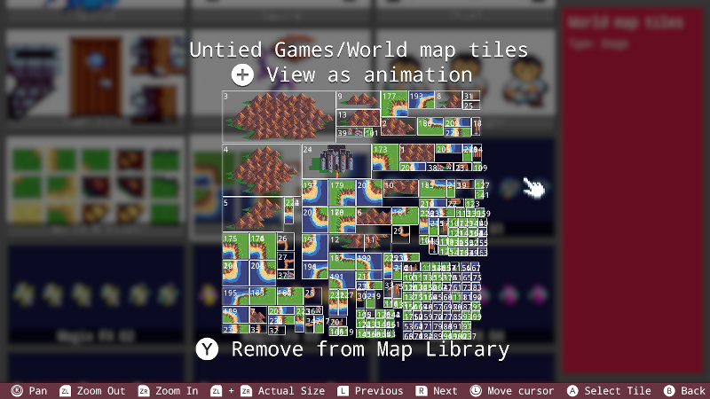

# 地图编辑器

**Fuze 4 Nintendo Switch** 地图编辑器被设计用来方便地创建自己的地图，先进入“Tools”界面，再选择“Map Editor”进入地图编辑器。当你第一次使用地图编辑器的时候，界面如下所示：

因为我们现在没有自己的项目，在这里目前我们没有什么事情可以做。首先让我们创建一个项目以便我们保存一个地图。返回到主界面并点击“Project”按钮，你将会进入下面这个界面：

现在我们能看到FUZE默认的一个项目的详细信息，“Hello World”

先择“New Project”按钮来创建一个新的项目，在这之后我们就能够为这个项目创建地图了。

输入标题，作者和描述信息。

创建一个项目来存储之后所有的地图是一个好的实践。这样就能比较方便地知道你的地图存储的位置了，方便之后在你的项目里进行引用。

当你创建了一个项目，你将会被带到代码编辑器的界面，按“-"键返回到主界面，之后选择“Tools”，再之后选择“Map Editor”进入到地图编辑器界面。你将看到下面的界面：

如图所示，我们能看到我们新建的项目，选择这个项目图标，你将会看到下面的界面：

在这个界面我们能看到在这个项目里面所有的地图文件，因为我们还没有创建任何一个地图，所以界面上显示的是“New Map”按钮。那么现在让我们创建一个地图。

之后会有一个弹窗，要求你为地图输入一个名字，如下如所示：

输入完名字，按下“+”按钮，你将会看到一段信息：“选择你要使用的素材”。

选择Ok，你就能使用素材浏览器来选择一些素材。比如，我们将使用一些由“Untied Games”创建的非常棒的素材。在素材浏览器中选择“Untied Games”艺术图标，那么我们能看到：

向下滚动，你能找到一个名字叫“Untied Games/World map tiles”，按下A键打开这个磁贴表，再按Y键来将这个素材添加到地图库里面显示在屏幕底部。

当按下Y键，你能注意到命令条上的文字发生了变化。我们能够按下Y键再把这个素材从地图库中移除。

现在，我们其实可以返回到素材浏览器并且继续添加新的素材到我们的地图库中，不过现在我们就使用当前这个磁贴表。按下B键返回，之后选择“+”进入地图编辑器：

现在我们在地图编辑器中，看一下屏幕底部。我们现在有两个选项，一是，通过同时按下L与R键，我们能添加更多的素材到我们的库里面；二是，我们可以打开当前选中的的精灵表并且使用这里面的素材来绘制地图。

