# 图片编辑器

*FUZE 4 Nintendo Switch*在提供了大量的素材给你用的同时，还能够让你通过使用图片与地图编辑器创建自己的精灵与关卡。

从主菜单，选择工具“Tools”图标，接着选择“Image Editor”图标，如果你是第一次使用FUZE，那么你将会看到如下的界面：

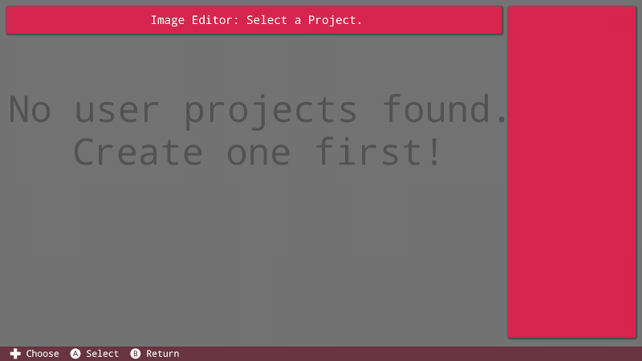

正如你所见，我们现在什么都没有。用户创建的图片都存储在单独的项目中，让我们创建一个项目来保存我们的图片。返回到主界面并选择“Project”项目图标：


这里我们能看到FUZE默认加载的项目，大家都爱的“Hello World”项目。我们想要创建一个新的项目来保存我们要创建的图片。选择“New Project”按钮并且输入一个新项目的名字，比如我在这里输入“Image Storage”来作为名字。

一旦你创建了一个项目，你将会被带到代码编辑器界面。通过按下“-”键来返回主界面，从主界面选择“Tools”之后选择“Image Editor”，就会进入到如下界面：

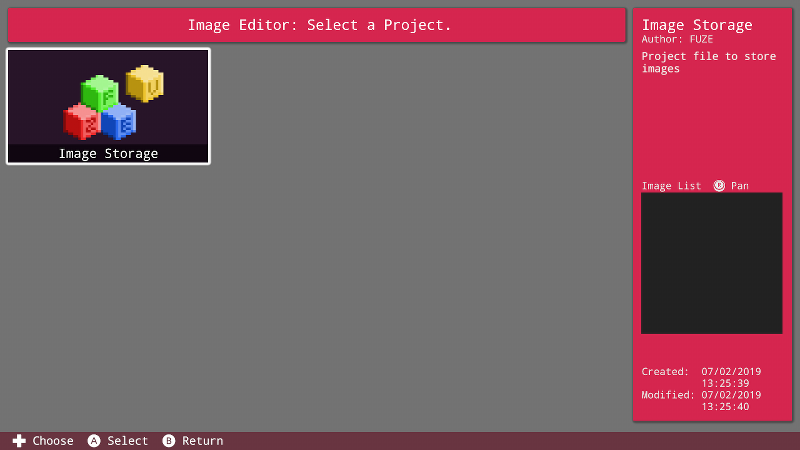

我们现在能够看到我们新建的项目了，选择这个项目图标，我们会被带到下一个界面：

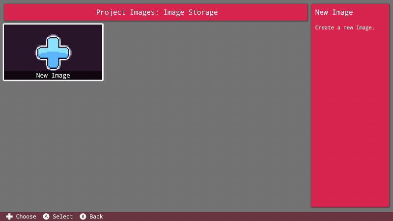

在这个界面，我们能看到所有保存在这个项目中的图片。因为我们现在一个图片都没有，所以选择“New Image”按钮来开始创作。

这之后你将会被要求输入一个图片名称，接下来按“+”号键来确认。一经完成，我们就会进入到图片编辑器的界面。

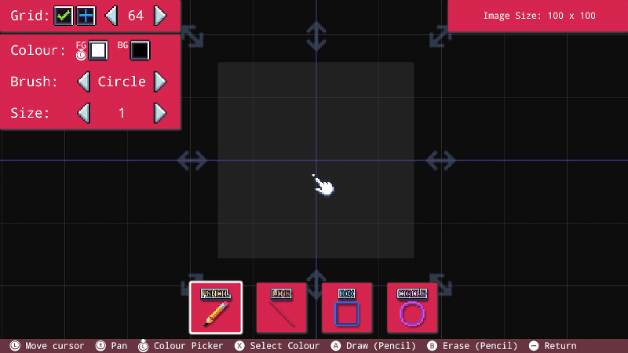

先看一下屏幕右上角的方框，这是你图片的大小，单位是像素。默认大小是100×100

如果要调整图片的大小，可以将光标移动到图片灰色方框周围任意一个灰色箭头上，用A键来选择，接下来通过来回按摇杆键来调整大小。

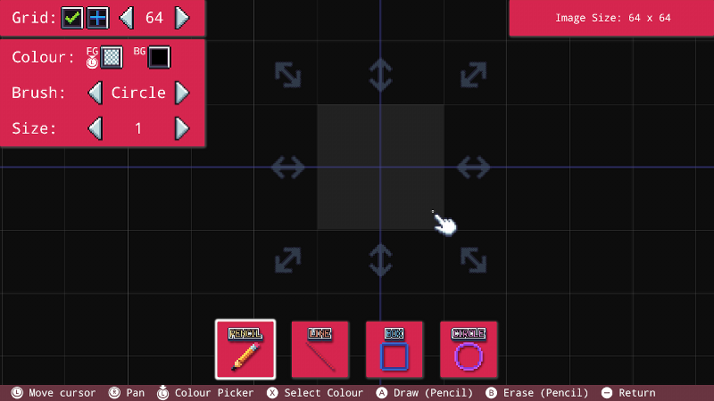

在调整到你想要的大小之后，通过再次按下A键来确认。这个操作也会让图片居中显示。正如你所见，我们把大小调整到了64×64，并且灰色方框显示在了屏幕的中间。

# 网格选项

接下来让我们看看左上角的选项。这里我们将会看到网格选项。移动光标到有绿色对勾的小方框上，通过按下A来切换显示或隐藏网格。

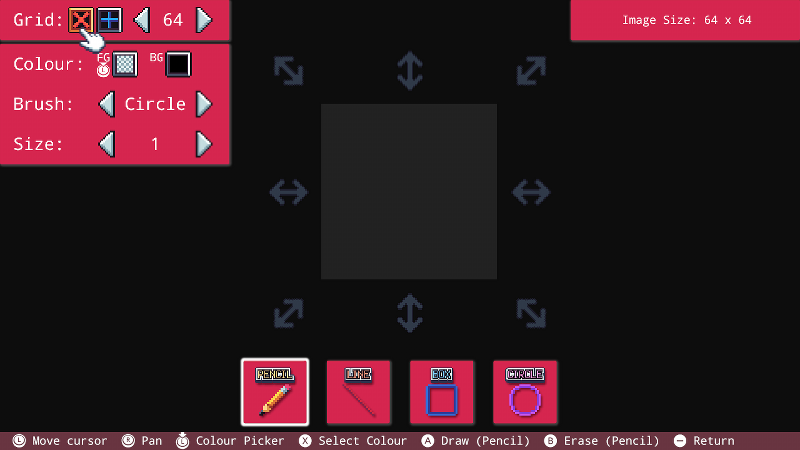

按下A之后，我们的网格小时了，之前有个绿色小勾的小方框现在出现了一个小红叉。再按一下A，我们的网格就又回来了。

紧挨这刚才那个小方框还有一个小方框，按下之后可以改变图片的原点：


最后，在数字64两边的两个箭头按钮用来改变网格的密度。设定一个较小的值，将会增加可以见的网格数，这在绘制图片细节的时候非常有用。

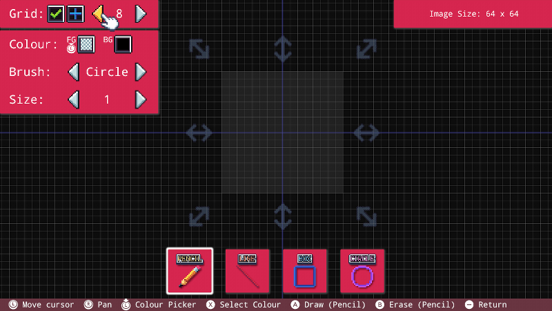

通过使用ZR与LR按键来缩放图片，ZR可以将图片放大，而ZL可以将图片缩小。同时按下ZL和ZR键，能够打开快速缩放菜单，如图所示：

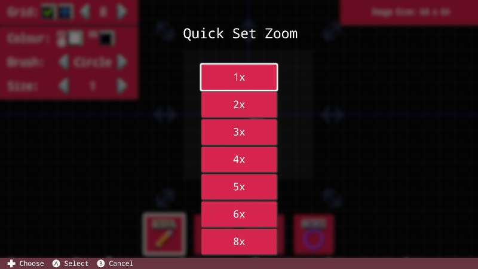

通过这个菜单，你能够快速选择一个缩放级别。

以上的内容大致覆盖了我们对图片的设置内容，接下来让我们看看如何使用笔刷。

# 笔刷选项

在网格选项的方框下面就是我们的笔刷相关的选项了。我们能够改变颜色，形状和大小。我们一会儿再看颜色，现在先让我们关注一下颜色下面的选项。

下面的“Brush”能够让我们将笔刷该变成方框或者圆形。当我们在画比较小的图片的时候，可以一个像素一个像素地画，这时选择方框形状的笔刷就是合适的选项。当为一个比较大的区域图色的时候，那么圆形的笔刷就会更合适一些。

最后，L与R键可以改变屏幕下方的选择，即在“Pencil”，“Line”，“Box”与“Circle”模式之间切换。这将改变我们绘画的方式，这些工具会让我们在画一些基础图形是时候更省力。当我们选择方框或圆形时，可以看到一些额外的选项：

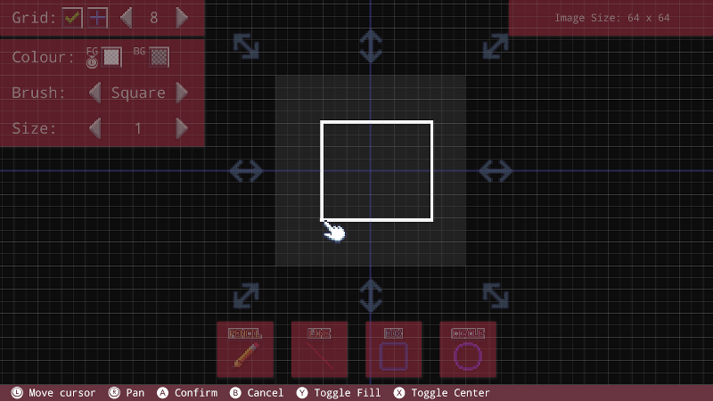

当在画一个方框或者圆形的时候，可以注意到底部的命令条，按下Y键将能够用背景色填充这个形状，按下X键，可以切换物体的中心。

# 颜色

让我们回过头来看一下剩下的颜色选项。我们有两个方框。一个是前景色（FG），另外一个是背景色（BG)。选择钱景色的方框并选择一个颜色，屏幕上会显示一个取色器。

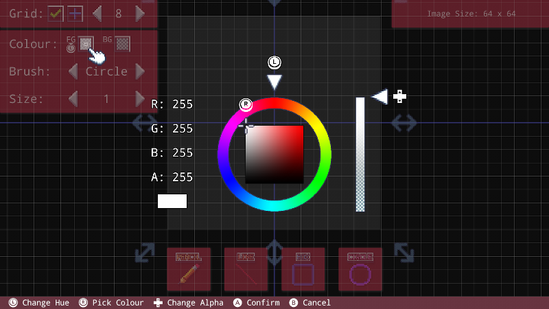

在这里你可以移动左右摇杆来选择一个颜色和一个HUE（色相）值。可以通过上下箭头键来调整透明度。

一旦你找到了一个你想用的颜色，那么就按A确定。这个动作将会改变钱景色的显示：

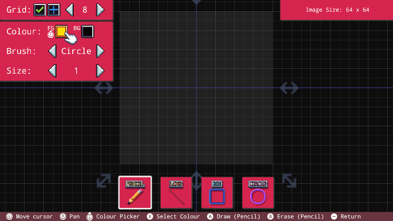

当我们按下A键画的时候，就是在使用前景色。

让我们用几种颜色画一个简单的图形：

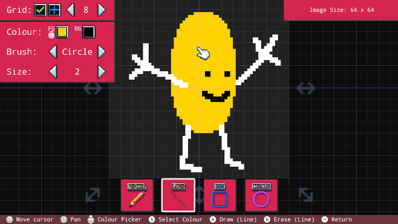

啊哈，这就是我的大作！

这里有一个非常有用的工具，能够让你快速切换画笔的颜色，比如让我们想要选择同样的白色来画的时候，只要将光标移动到白色的地方，按下X键，那么我们就能够快速地选择到白色：


可以注意到，前景色就变成了白色了。通过这个工具我们能够快色地在图片的任何地方取色。

另外，你可以通过按下做摇杆随时打开取色器。

# 加载并绘制你的图片

现在我们已经有一件完成的图片，让我们把它加载到一个程序里面。因为我们仅仅用现在这个项目来存储图片，我们需要将图片拷贝到其他项目。

通过在主界面选择“Project”图标来创建一个新项目，输入标题，作者还有描述信息。完成之后会进入代码编辑器，用“-”号键来返回到主界面。

选择“Tools”，之后选择“Image Editor”，你会看到如下的界面：

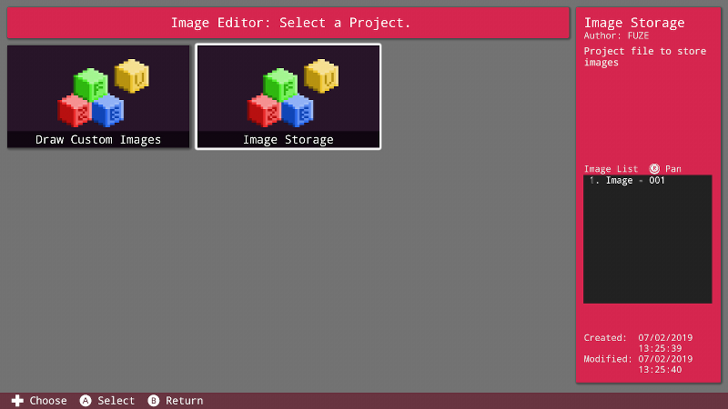

在左边我们能看到我们新建的项目，在这个新项目中，我们会用到刚才创建的图片。在其右边，我们的光标已经选中了保存图片的项目。你能在屏幕右边的项目详情方框区域看到一个图片的名称列表。

选择“Image Storage”项目的图标，我们能看到所有保存在这个项目里的图片。

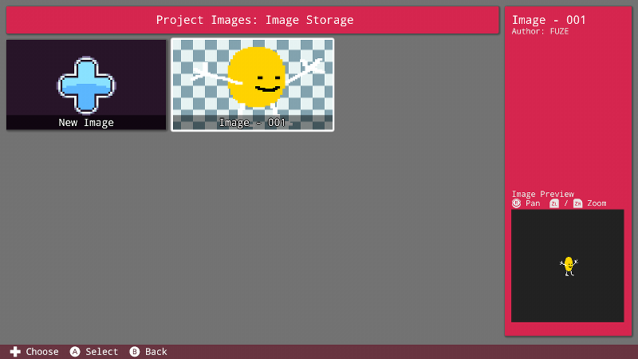

你能看到我们先前的图片显示在这里，移动光标到图片上并按下X键来看一些图片的选项：

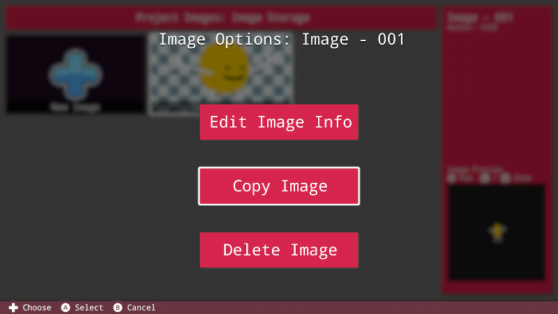

选择“Copy Image”选项，之后你能看到接下来的一些选项，你可以将图片拷贝到相同的项目或者你能拷贝图片到另外一个项目。

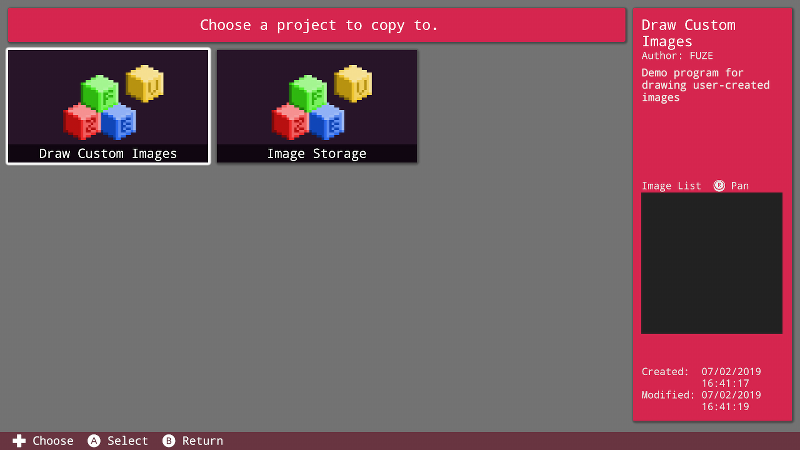

选择项目之后，会提示你为图片输入一个新名字。

# 代码

在你把图片拷贝到你的项目中之后，接下来就是来载入并绘制它了。

进入代码编辑器并输入下面的代码：

```
img = loadImage( "Image = 001", false )

loop
    clear()
    drawImage( img, gWidth() / 2, gHeight() / 2, 4 )
    update()
repeat
```
第一行，我们用要给变量来保存用```loadImage()```函数载入的图片。名称需要与你的图片名称一致。载入函数的参数传入false，意思对图片不做任何滤镜操作。这将保持我们图像边缘像素的锐利的显示效果。如果你想虚化边缘，那么就传入true来达到目的。

接下来，我们在一个循环中调用```drawImage()```将图片画在屏幕中间。并放大4倍。

现在，我们自己创作了一幅图片，并且把它加载并且显示在了屏幕上，我们能对它做些什么操作呢？唯一能限制你的就是你的想象力了！可以查看一下地下列出的函数，来获得更多信息。

**Image Commands**

```drawImage()```, ```drawImageEx()```, ```freeImage()```, ```imageSize()```, ```loadImage()```