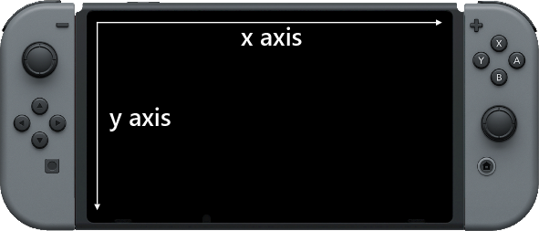
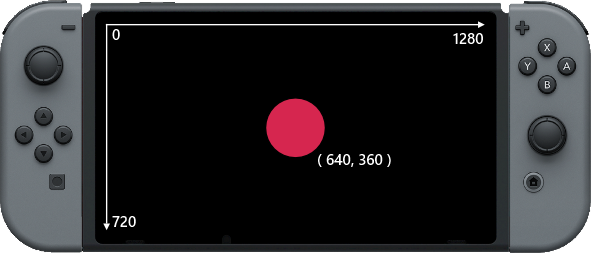

# 教程3：屏幕

在今天的教程中我们要看一下什么是屏幕，它的工作原理是什么以及我们如何在程序中用到它。

屏幕实际上是大量非常小的会发光的**像素点**组成，它们非常非常多。在Switch的屏幕上，一共有921600个**像素点**，将近一百万。

每当屏幕亮起来的时候，玩游戏的时候，浏览应用商店或者浏览主页面，Switch会以非常快的速度改变这921600个光点，实际上每秒钟会改变60次。

先消化一下，关于屏幕，有会更让你震惊的事实！

## X 和 Y

或许你已经很熟悉**xy**坐标系。不过如若你从来没有听说过，也没有关系，我会做一个快速的讲解。

屏幕上大量的像素点，是以直角坐标系的方式组织的，有**x轴**和**y轴**，如果有东西沿着**x轴**移动，那么它会从左边移动到右边。如果有东西沿着**y轴**移动，那么它会从上移动到下面。

看一下下面这张图片来了解是怎么回事：



主要到方向箭头的指向了吗？箭头方向表示数字沿着轴增加的方向。

两个轴上像素的技术都是从0开始，一步1个像素，这样平铺开来，就构成了屏幕。

Switch的屏幕在**x轴**上有1280个像素点，在**y轴**上有720个像素点。将两个数字相乘就得到了总共921600个像素点。

看一下下面的这张图片来看数字的增长方向：


在左上角的0表示**x轴**和**y轴**的位置在屏幕的左上角。

**x轴**的最大值在屏幕的最右边，**y轴**的最大值在屏幕的最下面。

## 电视模式与手持模式

有一个重要的点这里要说明一下，屏幕的分辨率（组成屏幕的像素数目）在电视模式与手持模式下是不一样的，当Switch放在底座上的时候，屏幕的分辨率大小为**1920x1080**像素，而不是**1280x720**。

## 在程序中使用坐标

如果我们想在屏幕正中央画一个圆。我们就必须只要两个轴的中心点，1280的一半是640,720的一半是360。

如果我们以640和320为中心点画圆，我们将得到下面的结果：



得到上面效果的代码如下：

```
  1. loop
  2.     clear()
  3.     circle( 640, 360, 100, 32, fuzepink, false )
  4.     update()
  5. repeat
```

简单漂亮，我们有一个循环，并使用一个```clear()```函数清空屏幕，用```update()```函数来将我们画的东西输送到屏幕上。

看一下第3行，这一行负责画一个圆。

```circle()```函数在括号中需要6个参数，用逗号隔开。

第一个参数是**x轴**的位置，第二个参数是**y轴**的位置。他们是一组坐标。

第三个参数```100```表示这个圆的大小。实际上表示这个圆的半径大小，也就是边缘到圆心的距离。如果一个圆的半径是100像素，那么也就是说这个圆有200像素宽。

接下来，下一个参数是圆的边数。没错，这个圆有32条边，它看上去很光滑，那是因为每一条半都非常短。我们可以改变这个来决定圆的外观，实际上我们可以通过改变变数把它完全变成另外一种形状。试着调整一下这个值，来看看变化。

## 移动这个圆

如果我们想让这个圆圈在屏幕上移动，我们需要两个变量来保存**x**和**y**的位置。

改变代码成如下所示：

```
  1. x = 640
  2. y = 360
  3. size = 100
  4. 
  5. loop
  6.     clear()
  7.     circle( x, y, size, 32, fuzepink, false )
  8.     update()
  9. repeat
```

现在我们用**变量**来表示圆的参数。所有的值都没有变化，不过我们现在可以在程序中改变这些值来使这个圆在屏幕上移动。

还记得在**变量**那一节出现的```+=```吗，在这里我们要使用这个符号。我们只加一行代码，如下所示：

```
  1. x = 640
  2. y = 360
  3. size = 100
  4. 
  5. loop
  6.     clear()
  7.     circle( x, y, size, 32, fuzepink, false )
  8.     x += 1
  9.     update()
 10. repeat
```

在```circle()```函数下面，我们加了一行，这一行将会在每次循环中将```x```的值增加1。因为我们用变量**x**来表示这个圆的**x**坐标，这将使这个圆在屏幕上移动。

运行一下程序，你会发现一个问题，这个圆会一直向右边移动，不会停下来。

## 让这个圆能够反弹

当变量**x**变得很大，就会跑出屏幕的范围，为了能让这个圆能够在边缘反弹回来，我们需要做一些事情。

首先，我们需要明白之所以这个圆圈能够朝某个方向移动，是因为我们改变了**x**和**y**的值。

让我们看一眼**x**轴，如果我们增大**x**，那么圆圈就会向右移动，如果我们减小**x**，那么圆圈就向左移动。

```
8. x += 1
```

负责移动圆圈的是上面这一行代码。

移动的快慢取决于每次加到**x**上的数值。上面的代码，在每次读入这一行代码的时候，我们增加了1个像素，如果我们把这个数字变大，那么圆圈移动的速度就会加快。减小这个数字，那么圆圈移动的速度就会减慢。

如果我们把这个值保存在一个**变量**中，我们就能做一些更有趣的事情。改变代码成如下所示：

```
 1. x = 640
 2. y = 360
 3. size = 100
 4. xSpeed = 3
 5.
 6. loop
 7.     clear()
 8.     circle( x, y, size, 32, fuzepink, false )
 9.     x += xSpeed
10.     update()
11. repeat
```

我们在第4行新加了一行代码，生命了一个叫```xSpeed```的变量，这个变量用来控制图形在**x轴**上面移动的速度，所以将这个变量命名成现在这样也是很合理的。

```x += 1```这一样也发生了变化，我们现在用变量来代替数字。

好了，现在我们已经准备好让这个圆形反弹回来了。

变量**x**会一直增加，屏幕是1280像素宽，当**x**的值变得大于屏幕宽度的时候，那么这个圆圈就已经跑出屏幕了，所以，当这种情况发生时，我们就需要进行一些处理。

为了实现这一点，我们需要添加一个**if表达式**，看看下面的代码：

```
  1. x = 640
  2. y = 360
  3. size = 100
  4. xSpeed = 3
  5.
  6. loop
  7.     clear()
  8.     circle( x, y, size, 32, fuzepink, false )
  9.     x += xSpeed
 10.     if x > gwidth() then 
 11.         xSpeed = -xSpeed
 12.     endif
 11.     update()
 12. repeat
```

在第10行，我们添加了一个**if表达式**，在这里我们检查变量**x**是不是已经大于屏幕的宽度了（这里用```gwidth()```来获得屏幕宽度）。

当你运行这个程序，你会注意到这个圆形应该会在屏幕的右边反弹，不过如果你仔细观察，你会注意到有一点不对劲。

变量**x**在这个圆形的中心，所以当**x**大于屏幕宽度的时候，有一般的圆形已经消失在屏幕外了。

为了修正这个错误，我们必须检查```x + size```是不是大于```gWidth()```，记住，变量**size**在这里用来标记圆形的半径大小，也就是这个圆形宽度的一半大小。正因为如此，```x + size```的值就是圆形精确的边缘位置，让我们稍微改动一下代码：

```
  1. x = 640
  2. y = 360
  3. size = 100
  4. xSpeed = 3
  5.
  6. loop
  7.     clear()
  8.     circle( x, y, size, 32, fuzepink, false )
  9.     x += xSpeed
 10.     if x + size > gwidth() then 
 11.         xSpeed = -xSpeed
 12.     endif
 13.     update()
 14. repeat
```
