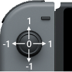

# 教程6: 使用控制器

在这个教程中，我们将学习如何在程序中使用**Joy-Con控制器**。

如果我们想开始写一个游戏，我们迟早会使用到控制器。

为了使用控制器，我们需要使用**if表达式**，毕竟我们需要查看**是否**有一个按键被按下。

下面就是一个简单的示例，输入下面的代码到编辑器中：

```
  1. loop
  2.    clear(black)
  3.
  4.    joy = controls(0)
  5.
  6.    if joy.a then
  7.        print("You are pressing the A Button!")
  8.    endif
  9.
 10.    update()
 11. repeat
```

这是一个很好的例子来讲解控制器的使用。我们想要的效果是如果A键被按下，那么就在屏幕上显示文本“You are pressing the A Button!”。

注意这个程序所有部分都在一个循环里面，我们希望我们的程序一直运行下去。在循环中我们做的第一件事情就是清空屏幕。我们使用了```clear()```和```update()```这两个方法，因为我们会改变在屏幕上显示的东西。

现在，让我们看看最重要的部分。

看看第4行。我们调用了一个**函数**```controls()```，这个**函数**会返回当前所有控制器的状态，这就是我们在程序中使用控制器的方法。

我们保存```controls()```返回的结果到一个**变量**中，这里是```joy```。

现在就可以了，我们可以访问所有的按键，通过```joy.a```，```joy.b```，```job.x```等等。

第6行就是我们用于条件判断的**if语句***，使用了控制器的数据。这一样我们用```if joy.a then```来检查控制器的A键是否被按下。

## 进阶

这里需要理解**if语句**的作用，检查的结果只能是```true```或者```false```。

当FUZE读到第6行的时候，它会检查```joy.a```是```true```还是```false```。

如果A键处于被按下的状态，那么```joy.a```是```true```。

如果A键没有处于被按下的状态，那么```joy.a```是```false```。

当我们写下代码```if joy.a then```，这里有一个隐藏的细节。实际上现在的第6行和```if joy.a == true then```是等价的。

## 挑战

你可以添加一个**if语句**再检查一下其它控制器的输入？同时你应该打印另一行字来表示另一个按键被按下。

查看一下```controls()```函数去了解Joy-Con控制器所有可能的输入。

## 用摇杆儿来移动一个圆形

还记得我们关于屏幕的教程吗？在那个教程里面，我们学习了如果通过使用**变量**在屏幕上移动圆形。

如果我们想用**Joy-Con控制器的摇杆**来移动这个圆形呢？其实要实现这一点非常简单。

我们需要使用```controls()```函数。让我们先回忆一下基础的程序模板。

```
  1. x = gwidth() / 2
  2. y = gheight() / 2
  3. radius = 100
  4.
  5. loop
  6.     clear()
  7.     circle( x, y, radius, 32, fuzepink, false )
  8.     update()
  9. repeat
```

我们有一个简单的**loop**，在**变量x和y**的地方画一个圆。

让我们定义一个变量来使用```controls()```函数：

```
  1. x = gwidth() / 2
  2. y = gheight() / 2
  3. radius = 100
  4.
  5. loop
  6.     clear()
  7.     joy = controls( 0 )
  8.     circle( x, y, radius, 32, fuzepink, false )
  9.     update()
 10. repeat
```

像之前一样，我们创建了一个**变量**```joy```来保存```controls()```返回的数据。

通过```.lx```和```.ly```来访问左摇杆的**x**和**y**轴。

首先我们要了解控制器的摇杆是怎么工作的。看一下下面的图：



如你所见，如果```controls()```函数返回的值如果是**0**，则表示摇杆没有被按向任何一个方向。

只要摇杆被按向任何一边，返回的值就会是1或者-1，这之间有很多值，实际上，每一个轴向上有65000不同的位置。

如果```.lx```大于0，我们就知道摇杆被推向了正方向，也就是说摇杆被推向了右边。如果值小于0，我们就知道摇杆被推向了负方向，也就是说摇杆被推向了左边。

结合上面的新知识，我们修改一下代码，让圆形在**x**轴上移动。

```
  1. x = gwidth() / 2
  2. y = gheight() / 2
  3. radius = 100
  4.
  5. loop
  6.     clear()
  7.     joy = controls( 0 )
  8.     x += joy.lx
  9.     circle( x, y, radius, 32, fuzepink, false )
 10.     update()
 11. repeat
```

看，我们只添加了一行代码。

在第8行，我们简单地将**变量**```x```的值和左摇杆的值相加。如果摇杆被推向右边，我们将得到一个正数，所以圆形就会网右边移动，如果摇杆被推向左边，那么我们将会得到一个负数，那么圆形就会向左边移动。

现在，因为这些数字非常小，我们的圆会移动地非常慢，不是很有用，让我们添加一个速度**变量**来作为数值放大器。看一下下面的代码：

```
  1. x = gwidth() / 2
  2. y = gheight() / 2
  3. radius = 100
  4. speed = 8
  5.
  6. loop
  7.     clear()
  8.     joy = controls( 0 )
  9.     x += joy.lx * speed
 10.     circle( x, y, radius, 32, fuzepink, false )
 11.     update()
 12. repeat
```

有了这个改变，我们将会看到很明显的效果。

在第9行，我们通过乘上```speed```**变量**，增大```x```**变量**的值。这将会把移动速度变成原来的8倍。尝试改变一下```speed```**变量**，查看一下效果。

好的，让我们让这个圆能在**y**轴上移动。这会让程序变得复杂一点。

```
  1. x = gwidth() / 2
  2. y = gheight() / 2
  3. radius = 100
  4. speed = 8
  5.
  6. loop
  7.     clear()
  8.     joy = controls( 0 )
  9.     x += joy.lx * speed
 10.     y -= joy.ly * speed
 10.     circle( x, y, radius, 32, fuzepink, false )
 11.     update()
 12. repeat
```

第10行是我们新添加的，可以注意到我们用的是```-=```而不是```+=```，那是因为屏幕的顶部也就是**y**轴的0，但是控制器的**y**轴向上推是正方向，再看一下下面的图：


当我们把摇杆往上推，我们将会得到一个正数，为了让圆形能往上移动，我们需要减小变量```y```的值，而不是增大它，所以我们使用了```-=```

## 创建边界

为了不让圆形移动出边界，我们需要添加一个**if语句**来判断。就像在有关屏幕的那一个教程中一样，我们需要检查```x```和```y```的值，为了不反转方向，我们需要重新定义**变量**```x```和```y```。

我们从让运行在**x**的边界上停下来开始。

```
  1. x = gwidth() / 2
  2. y = gheight() / 2
  3. radius = 100
  4. speed = 8
  5.
  6. loop
  7.     clear()
  8.     joy = controls( 0 )
  9.     x += joy.lx * speed
 10.     y -= joy.ly * speed
 11.     if x + radius > gwidth() then
 12.         x = gwidth() - radius
 13.     endif
 14.     if x - radius < 0 then
 15.         x = radius
 16.     endif
 17.     circle( x, y, radius, 32, fuzepink, false )
 18.     update()
 19. repeat
```

从第11行到16行是我们第一个**if语句**，我们需要检查圆形的边缘```x + radius```是不是大于了屏幕的边缘```gwidth()```，如果是，我们就重新定义```x```，将它的值设置成屏幕的边缘减去圆的半径，也就是```x = gwidth() - radius```。

在屏幕左边我们要做同样的事情，只不过反转了一下，我们检查```x - radius```的值是不是小于0，如果是，那么我们重新定义```x```的值为0加圆的半径。可以直接写成```x = radius```。

足够简单，让我们在**y**轴上做同样的检查：

```
  1. x = gwidth() / 2
  2. y = gheight() / 2
  3. radius = 100
  4. speed = 8
  5.
  6. loop
  7.     clear()
  8.     joy = controls( 0 )
  9.     x += joy.lx * speed
 10.     y -= joy.ly * speed
 11.     if x + radius > gwidth() then
 12.         x = gwidth() - radius
 13.     endif
 14.     if x - radius < 0 then
 15.         x = radius
 16.     endif
 17.     if y + radius > gheight() then
 18.         y = gheight() - radius
 19.     endif
 20.     if y - radius < 0 then
 21.         y = radius
 22.     endif
 23.     circle( x, y, radius, 32, fuzepink, false )
 24.     update()
 25. repeat
```

这样就好了，这样的移动代码可以被应用到任何程序中，在接下来的教程中，我们会讲一些更高级的移动技巧，但是这中简单的移动就可以让你做很多项目试验了。

#### 用到的函数和关键字

```clear()```,```controls()```,```endif```,```if```,```input()```,```loop```,```print()```,```repeat```,```then```,```update()```