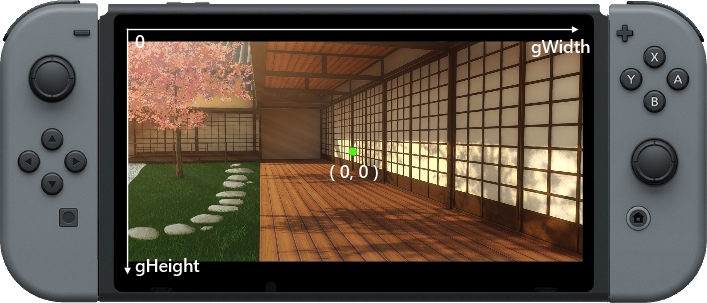

# 教程11：载入与绘制图片

哈喽，很高兴再次见到你！

在这个教程中，我们将会覆盖一些在FUZE使用资源浏览器载入图片，并且利用内置的**函数**来绘制他们的基础知识。

同时我们还会讲解一些关于缩放、旋转图片等一些自定义操作。

当要在**FUZE**中使用图片的时候，我们必须先加载图片并赋值给一个**变量**。

为了达到这个目的，我们使用```loadImage```**函数**。

```
  1. img = loadImage()
```

在**FUZE**中，当你输入```loadImage()```这个**函数**时，如果我们把光标放到括号中，你可以注意到在我们的屏幕键盘上的“media”键出现一个发光的轮廓。点击它就会进入到素材浏览器。

当在素材浏览器中选择了你要使用的图片后，那么系统会自动将资源的资源名称粘贴到括号里面，并且加上双引号。

当我们选择一个来自于艺术家Selavi的一张图片

```
  1. img = loadImage( "Selavi Games/JapaneseSetting", false )
```

注意到```loadImage()```中的```false```参数。这个参数告诉FUZE是否需要在图片上应用滤镜，此时我们不需要应用滤镜，所以我们给出了```false```。

现在我们有了一个叫```img```的**变量**，保存着刚刚载入的图片。我们可以在很多其他**函数**中使用这个**变量**。

我们先从简单的开始，把图片显示在屏幕上。我们需要在循环中使用标准的```clear()```和```update()```函数。

```
  1. img = loadImage( "Selavi Games/JapaneseSetting", false )
  2.
  3. loop
  4.     clear()
  5.    
  6.     update()
  7. repeat
```

我们只要添加一个```drawImage()```**函数**就可以了。

```
  1. img = loadImage( "Selavi Games/JapaneseSetting", false )
  2.
  3. loop
  4.     clear()
  5.    
  6.     drawImage( img, 0, 0, 1 )
  7.
  8.     update()
  9. repeat
```

运行程序，可以发现图被很完美地显示在了屏幕上。

## drawImage()

让我们仔细看一下这个**函数**，看看调用时具体发生了什么。

第一个参数是我们用来存储载入图片的**变脸**，非常简单。

接下来的两个参数是要绘制图片的位置，即屏幕的**x**和**y**坐标。```0, 0```是屏幕的最左上角。

最后一个参数是**缩放系数**，这个参数用来在绘制图片的时候乘以图片的长和宽，对图片进行缩放。

我们使用```1```来表示保持原始的大小。如果我们想让图片更小一点。

```
  1. img = loadImage( "Selavi Games/JapaneseSetting", false )
  2.
  3. loop
  4.     clear()
  5.    
  6.     drawImage( img, 0, 0, 0.1 )
  7.
  8.     update()
  9. repeat
```

我们使用了```0.1```的缩放比例，那么图片的大小就会变成原来的十分之一。

接下来让我们看一个更复杂的```drawImageEx()```**函数**来对图片做一些更酷的操作。

## drawImageEx

不同于```drawImage()```**函数**，通过使用```drawImageEx()```，我们能够对图片有更多的控制。这个**函数**拥有更多的参数，看一下下面的代码：

```
  1. img = loadImage( "Selavi Games/JapaneseSetting", false )
  2. xPos = gwidth() / 2
  3. yPos = gheight() / 2
  4. rotation = 0
  5. wScale = 0.7
  6. hScale = 0.7
  7. r = 1
  8. g = 1
  9. b = 1
 10. a = 1
 11. originX = 0
 12. originY = 0
 13.
 14. loop
 15.     clear()
 16.    
 17.     drawImageEx( img, xPos, yPos, rotation, wScale, hScale, r, g, b, a, originX, originY )
 18.
 19.     update()
 20. repeat
```

让我们看看这所有的参数，通过使用```drawImageEx()```，我们几乎可以控制图片的所有东西。

为了让**函数**调用更清晰一些，我在程序的上方定义了一些**变量**来保存各个参数，让我们能更清楚看到每个参数的内容，顺序与在调用中的顺序一致。

前3个参数我们已经熟悉了，我们知道```img```是保存图片的**变量**，接下来的两个参数```xPos```和```yPos```是绘制图片的位置，也就是屏幕的**x**和**y**坐标。

## 旋转

下一个参数就变得有趣了。这个参数控制图片旋转的角度。这里我们设置```rotation```**变量**为0，如果我们设置它的值为180，那么图片会颠倒过来显示。

## 缩放

接下来两个参数分别是图片宽度和高度的缩放比例。把这两个值都设置成1，图片会保持原先的尺寸。改变这些值会对图片产生拉伸效果。例如，如果改变**变量**```hScale```的值设置成0.5，那么图片的高度会变成宽度的两倍。

## RGBA

下一个参数非常酷，我们用四个分开的数字来表示红色、蓝色、绿色和透明通道的值。尝试去修改```r```,```g```,```b```的值为```1```,```0```和```0```来得到一个染成红色的图片。尝试```0```到```1```之间的任何数字来得到不同的染色结果。

## 原点

这个参数会有点反常，原点是开始绘制图片的**起点**。默认情况下，原点被设置为两个轴向的0点，即**x**和**y**的0点。记住，当我们提到**屏幕**，（0，0）指的是屏幕的左上角。然而，当讲到图片，（0，0）为图片的**中心**位置。看一下下面的图片：




一个图片的原点```(0,0)```，如果给参数```x```和```y```的值为```(gwidth()/2, gheight()/2)```，那么我们的图片就会被绘制在屏幕正中心。

如果我们改变原点的位置，但是保持**x**和**y**的值不变，会发生什么？


如果我们设置原点的**x**值为```-imageW(img)/2```（图片宽度一半取负值），保持**x**和**y**的位置坐标不变，图片的原点为图片的最左边，图片会从原点的位置开始绘制。这里```imageW()```**函数**返回图片宽度的像素值，```imageH()```**函数**返回图片高度的像素值。

## 在程序中操作图片

让我们看一个这些特性的有趣例子。我们会在循环中旋转图片

```
  1. img = loadImage( "Selavi Games/JapaneseSetting", false )
  2. xPos = gwidth() / 2
  3. yPos = gheight() / 2
  4. rotation = 0
  5. wScale = 0.7
  6. hScale = 0.7
  7. r = 1
  8. g = 1
  9. b = 1
 10. a = 1
 11. originX = 0
 12. originY = 0
 13.
 14. loop
 15.     clear()
 16.    
 17.     drawImageEx( img, xPos, yPos, rotation, wScale, hScale, r, g, b, a, originX, originY )
 18.
 19.     rotation += 1
 20.
 21.     update()
 22. repeat
```

运行程序能看到图片在屏幕上旋转。

可以看到图片**以原点为中心**旋转。如果我们改变原点的位置，我们也会改变旋转的点，尝试下面的更改：

```
  1. img = loadImage( "Selavi Games/JapaneseSetting", false )
  2. xPos = gwidth() / 2
  3. yPos = gheight() / 2
  4. rotation = 0
  5. wScale = 0.7
  6. hScale = 0.7
  7. r = 1
  8. g = 1
  9. b = 1
 10. a = 1
 11. originX = 800
 12. originY = 300
 13.
 14. loop
 15.     clear()
 16.    
 17.     drawImageEx( img, xPos, yPos, rotation, wScale, hScale, r, g, b, a, originX, originY )
 18.
 19.     rotation += 1
 20.
 21.     update()
 22. repeat
```

这里我们做的唯一修改就是把```originX```和```originY```改成了800和300。运行程序能看到旋转变的不一样了！

好了，已经有够多的旋转了，通过操作红色，绿色，蓝色还有透明通道，我们可以很方便地改变图片的亮度：

```
  1. img = loadImage( "Selavi Games/JapaneseSetting", false )
  2. xPos = gwidth() / 2
  3. yPos = gheight() / 2
  4. rotation = 0
  5. wScale = 0.7
  6. hScale = 0.7
  7. r = 1
  8. g = 1
  9. b = 1
 10. a = 1
 11. originX = 0
 12. originY = 0
 13.
 14. loop
 15.     clear()
 16.     j = controls( 0 )    
 17.
 18.     a += j.ly / 50
 19.     g += j.ly / 50
 20.     r += j.ly / 50
 21.
 22.     if r < 0 then r = 0 endif
 23.     if g < 0 then g = 0 endif
 18.
 19.     drawImageEx( img, xPos, yPos, rotation, wScale, hScale, r, g, b, a, originX, originY )
 20.
 21.     update()
 22. repeat
```

运行程序，上下推动左摇杆来控制亮度，向下推使图片变得黯淡且更蓝。向上推会让图片变得更明亮。在这个例子中，我们把图片的原点设置到了（0，0）。

16到32行是新添加的代码，首先我们调用```controls()```**函数**来访问控制器，我们用**变量**```j```来保存控制器的状态。

第18到20行，我们使用左摇杆来控制```a```,```g```和```r```的值，```a```**变量**来保存**alpha**通道（图片的透明度）。如果我们**减小**这个值，会让图片变得黯淡，如果**增加**这个值，会让图片变得明亮。因为控制器的值可能是正值也可能是负值，我们简单地将值加到结果**变量**当中。

我们对**变量**```r```和```g```做同样的操作，来改变图片的红色和绿色。当摇杆向下推动时，我们减少来红色和绿色，那么图片中就剩下蓝色。同时当透明度升高时，我们能看到更多的黑色背景。这样能给出一个很不错的黯淡的蓝色效果。

这种技术对于角色之间有很多对话的游戏来说非常有用。

为什么不试试改变一下背景和亮度呢？

我们下次再见！

#### 用到的函数和关键字

```clear()```,```drawImage()```,```drawImageEx()```,```else```,```endif```,```gWidth()```,```gHeight()```,```if```,```loadImage()```,```loop```,```repeat```,```then```,```update()```