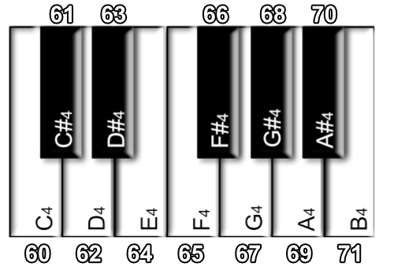

# 教程13：制作音乐

你的游戏有动听的音乐吗？如果没有的话，别担心，很快就会有了！在这一节教程我们将使用```playNode()```函数来创建我们自己的音乐。

我们在以前就在**for循环**那一节的项目中非常简略地接触过```playNode()```。在这一节中，我们将会接触更多的细节。

## playNote()

让我们快速地看一些这个**函数**的定义然后讲解一下各个参数：

```
playNote( channel, waveType, frequency, volume, speed, pan )
```

```channel``` 参数告诉FUZE要在哪一个频道来播放我们想要播放的音符。总共有16个频道可以使用，也就是说FUZE可以同时播放16个频道的声音。他们可以是音符，音轨或者声效。

```frequency``` 表示你想要播放的音符的频率。表示频率的另外一个词是**音调**。频率越高，则音符的音调越高。

频率的单位是赫兹（hz），表示**每秒钟声音的震动次数**。如果你的鼓膜每秒钟震动了440次，那么你听到的就是音符A（la）。人的耳朵能听到范围从20hz到20000hz的声音。任何在这个外围之外的声音，我们都是不能听到的。

```waveType```  表示我么在播放声音是想使用的**波形**。在FUZE中一共有5种波形，用数字表示分别是：矩形Square(0), 锯齿sawtooth(1), 三角triangle(2), 正弦sine(3) 和 噪音noise(4)。每一种波形的声音听起来非常不同。每种都试试看！

```volumne``` 很简单，表示声音的响度。这个值应该在0到1之间，但是如果需要的话，可以给更大的值。

```speed``` 表示声音的延音，这个数值越小，则这个音符的时长会更长。数值越大，则时长更短。

```pan``` 表示声音的空间位置，你的任天堂Switch有两个扬声器频道，一个左声道一个右声道。这个数值表示在两个频道之间的位置。0.5表示两者的正中间，一个接近0的值会让声音向左移动，接近1的值会让声音向右移动。

## 一个例子

我们添加一些参数到这个参数，看会发生什么：

```
  1. playNote( 0, 3, 432, 1, 0.5, 0.5 )
  2. loop
  3.     clear()
  4.     update()
  5. repeat
```

在这个程序中，在进入循环的时候会播放一个音符。注意```playNode()```这一行不在循环里面，因为我们只想让这个音符播放一次。这个音符会持续响几秒钟然后消失。

尝试修改这些参数来得到不同的结果。

## note2Freq()

在FUZE中，我们有一个函数叫```note2Freq()```。在制作音乐的时候我们不需要考虑**频率**，而是直接通过使用音符的名称。例如音符A，在中音C之上，（也就是A4这个音），它的频率是440hz，音乐家在作曲的时候，是不会把各个音的频率列出来的。

在之前，有一个非常聪明的人叫Dave Smith，他发明了一种方法，能够发送数据给电子乐器，让其演奏特定的音符。这就是MIDI（音乐数字接口）。在MIDI中，有128个音符可供选择，每一个音符都有一个数字来表示，我们之前提到的A4的数字是69.

```note2Freq()``` 接受一个MINI音符的数字，然后把这个数字转化为**频率**。这在我们制作音乐是非常有帮助。

在移动到下一个部分之前，开一个新的项目!

## 创建一个音符数组

如果我们想用音符的名字来制作音乐，我们需要把MINI音符存在内存中。我们可以使用一个结构体来完成。

```
  1. n = [
  2.     .c  = 60,
  3.     .cs = 61,
  4.     .d  = 62,
  5.     .ds = 63,
  6.     .e  = 64,
  7.     .f  = 65,
  8.     .fs = 66,
  9.     .g  = 67,
 10.     .gs = 68,
 11.     .a  = 69,
 12.     .as = 70,
 13.     .b  = 71
 14. ]
```

好了，我们创建了一个结构体变量```n```来保存我们想要播放的音符。比如现在我们就可以用形如```n.d```这样的方式来访问D音符。

以一个“s“结尾的音符表示在两个音符之间的音，叫”升音“，或者也可以叫”降音“。C升的音高等同于D降，但是我们为了保持简单，只使用升音。



现在我们有一个12个音符（包含所有中间的音符）的音阶。这个被称为**半音音阶**，利用这个音阶我们可以创作任何我们想要的音乐。

在我们编写一个旋律之前，我们还需要多用几个**变量**。音符不仅有一个音高，还需要一个长度，对于音符的时长，用一些音乐术语来表示。这里有4个，分别是十六分音符，八分音符，四分音符和二分音符，他们的值分别是：

```
  16. semiquaver = 0.25
  17. quaver = 0.5
  18. crotchet = 1
  19. minim = 2
```

在这里我们创建一些保存长度的变量。他们的长度都是相对于**一拍**来说的。这里以四分音符为一拍，八分音符为一个四分音符的一半（0.5），而十六分音符为八分音符的一半（0.25）。

现在让我们用这些变量来创建一小段旋律，保存每一个我们想要播放的音符在一个数组中。

```
 21. melody = [
 22.     [ .note = n.d, .spd = 40, .l = quaver    ],
 23.     [ .note = n.e, .spd = 40, .l = quaver    ],
 24.     [ .note = n.f, .spd = 40, .l = quaver    ],
 25.     [ .note = n.g, .spd = 40, .l = quaver    ],
 26.     [ .note = n.e, .spd = 20, .l = crotchet  ],
 27.     [ .note = n.c, .spd = 40, .l = quaver    ],
 28.     [ .note = n.d, .spd = 20, .l = minim * 4 ]
 29. ]
```

这就是我们的旋律，如你所见，我们创建了一个叫```melody```的**数组**，保存了**7个结构体**。每一个**结构体**表示旋律中的每一个音符。每一个音符都有一个```.note```属性表示从**结构体**中取出的MIDI码。还有一个```.spd```值来表示在调用```playNode()```函数时的**speed**参数。最后还有一个```.l```参数来表示音符的时值。

使用这种格式，你能够很容易的制作一段音乐。即使这需要打很多很多字！

在我们播放音乐之前。我们必须转换这些音符时值为真是的时间值。从音符的时值我们能知道一个音符的长度，但是这并不知真是的时间长度。有一个很聪明的方法来完成这件事情。

```
 31. endTime = 0
 32. counter = 0
 33.
 34. for i = 0 to len( melody ) loop
 35.     temp = melody[i].l
 36.     melody[i].l = counter
 37.     counter += temp
 38. repeat
 39.
 40. endTime = counter
```

首先我们创建了两个**变量**。```endTime```最后会保存着这个旋律结束的时间。```counter```用来记录在**for循环**的音符时长。

我们的**for循环**使用一个变量```i```来计数从0到**数组**长度的长度。对于在旋律中的每一个音符，我们保存音符的长度在一个临时变量```temp```中。接着我们将这个音符的长度设置为```counter```的值。由于```counter```是从0开始的，第一个音符的长度为0，完美，因为我们想让第一个音符立即播放。

之后我们让```counter```的值加上```temp```的值，给我们一个下一个音符改在什么时候播放的时间值。对于每一个音符都会走这个过程，最后我们就根据每个音符的时值得到了每个音符真实开始时间。

当**for循环**完成的时候，我们的```counter```变量就保存了这条旋律正常结束的时间。所以我们将```couter```的值赋值给```endTime```。

接下来，我们只要在**主循环**中再准备一些变量，就能开始播放音乐了。

```
 42. noteCount = 0
 43. timer = 0
```

这两个**变量**非常重要，```noteCount```将会用来索引```melody```中的音符，```timer```将会用来记录已经过去的时间。我们将会用```timer```变量作为一个触发器来告诉FUZE，什么时候需要移动到```melody```的下一个音符。

## 播放音符

好了，让我们把所有这些东西整合到一起：

```
 45. loop
 46.     clear()
 47.    
 48.     if noteCount < len( melody ) then
 49.         if timer >= melody[noteCount].l then
 50.             note = note2Freq( melody[noteCount].note )
 51.             speed = melody[noteCount].spd
 52.             playNote( 0, 3, note, 1, speed, 0.5 )
 53.             noteCount += 1
 54.         endif
 55.     endif
 56.
 57.     timer += ( 120 / 60 ) / 60
 58.    
 59.     if timer >= endTime then
 60.         stopChannel( 0 )
 61.     endif
 62.    
 63.     update()
 64. repeat
```

当你敲玩所有代码的时候，就运行这段代码来听听吧！

在循环中，我们有几个非常聪明的**if表达式**。在我们开始看他们之前，首先看一下第57行：

```
 57.     timer += ( 120 / 60 ) / 60
```

这一行代码负责部分记录时间的功能。播放音乐的速度叫拍子。这个值按每分钟的节拍数来计算，或者叫BPM（beats per minute)。我们这段旋律使用的是每分钟120拍。

我们的循环每秒钟会运行60次，每一次循环，```update()```方法就会运行一次。

为了让节拍正确，我们不是要弄清楚每分钟一定要演奏多少个拍子，而是要弄清楚**每一帧**有多少拍子。

为了达到这个目的，我们用每分钟的节拍数120来除以60来得到每秒钟有多少个拍子。然后我们用这个值除以60来得到每帧对应的拍子数。

所有这些的意义在于，我们可以让计时器在一个可以120拍每分钟，60帧每秒的速率上来计数。非常聪明！

现在让我们看一看这个**if语句**：

```
 48.     if noteCount < len( melody ) then
 49.         if timer >= melody[noteCount].l then
 50.             note = note2Freq( melody[noteCount].note )
 51.             speed = melody[noteCount].spd
 52.             playNote( 0, 3, note, 1, speed, 0.5 )
 53.             noteCount += 1
 54.         endif
 55.     endif
```

首先，我们检查```noteCount```是否小于我们旋律的长度，接下来，我们检查```timer```是否已经到达了当前音符开始播放的时间。

如果这两个条件都满足，我们设置几个变量，来让我们对```playNode()```的调用更加可读。```note```变量保存了这个音符的频率，通过调用```note2Freq()```来得到。

```speed```变量来保存来自音符结构体的```.spd```属性。

接着我们调用```playNode()```函数在频道0上播放音符，使用了柔和的正弦波形，最大的音量，立体声正中间的位置。

在我们结束这个**if表达式**之前，我们增加```noteCount```来保证我们接下来会播放下一个音符。

就这些了！

尝试改变旋律，添加你自己的音符，改变时间，改变BMP。对这些的改变没有对错，摇摆起来！

其实在你开始调整之前，我们再添加一些混响效果，能让声音听起来更加甜美：

```
 44. setReverb( 0, 8000, 0.5 )
```

在开始**循环**之前，添加这一行到你的程序中。这个函数可以设置一些混响，回声到一个频道。

括号中的第一个数字表示一个频道。这里使用第0个频道，因为我们的旋律是用频道0来播放的，只有这样才能听到效果。

第二参数表示我们在多少毫秒之后能听到回声。

最后一个参数表示应用到每一次回声的放大系数。数字越小，回声消失的约快，反之越慢。这个值在0和1之间。

现在运行程序，应该能听到很不一样的声音。

继续向前，制作自己的旋律把！

## 创作自己的旋律

我们写的这个程序只会播放我们的旋律，之后停止频道的所有声音：

```
 59.     if timer >= endTime then
 60.         stopChannel( 0 )
 61.     endif
```

用这个**if语句**我们检查```timer```变量是不是已经到达了结束时间```endTime```。如果满足条件，我们会调用一个```stopChannel()```命令来结束所有的声音。如果我们希望我们的旋律循环播放，我们可以修改程序如下所示：

```
 59.     if timer >= endTime then
 60.         noteCount = 0
 61.         timer = 0
 62.     endif
```

现在，如果我们的```timer```到达了```endTime```，我们重设```timer```和```noteCount```为0，来让整个播放过程从头开始。

下面是完整的项目代码，以供参考，保证你的代码正常工作，再使用在其他项目里面！

```
  1. n = [
  2.     .c  = 60,
  3.     .cs = 61,
  4.     .d  = 62,
  5.     .ds = 63,
  6.     .e  = 64,
  7.     .f  = 65,
  8.     .fs = 66,
  9.     .g  = 67,
 10.     .gs = 68,
 11.     .a  = 69,
 12.     .as = 70,
 13.     .b  = 71
 14. ]
 15.
 16. semiquaver = 0.25
 17. quaver = 0.5
 18. crotchet = 1
 19. minim = 2 
 20.
 21. melody = [
 22.     [ .note = n.d, .spd = 40, .l = quaver    ],
 23.     [ .note = n.e, .spd = 40, .l = quaver    ],
 24.     [ .note = n.f, .spd = 40, .l = quaver    ],
 25.     [ .note = n.g, .spd = 40, .l = quaver    ],
 26.     [ .note = n.e, .spd = 20, .l = crotchet  ],
 27.     [ .note = n.c, .spd = 40, .l = quaver    ],
 28.     [ .note = n.d, .spd = 20, .l = minim * 4 ]
 29. ]
 30.
 31. endTime = 0
 32. counter = 0
 33.
 34. for i = 0 to len( melody ) loop
 35.     temp = melody[i].l
 36.     melody[i].l = counter
 37.     counter += temp
 38. repeat
 39.
 40. endTime = counter
 41.
 42. noteCount = 0
 43. timer = 0
 44. setReverb( 0, 8000, 0.5 )
 45.
 46. loop
 47.     clear()
 48.    
 49.     if noteCount < len( melody ) then
 50.         if timer >= melody[noteCount].l then
 51.             note = note2Freq( melody[noteCount].note )
 52.             speed = melody[noteCount].spd
 53.             playNote( 0, 3, note, 1, speed, 0.5 )
 54.             noteCount += 1
 55.         endif
 56.     endif
 57.
 58.     timer += ( 120 / 60 ) / 60
 59.    
 60.     if timer >= endTime then
 61.         stopChannel( 0 )
 62.     endif
 63.    
 64.     update()
 65. repeat
```

## 同时播放多个旋律

哈，你想加一些和声？

这是可以实现的。如我们之前提到的，我们一共有16个频道可以使用。也就是说如果你想，我们最多可以有16条旋律一同播放，即便这样会让音乐很难听辨。

在我们继续之前，开启一个新项目。我们需要与之前一样的音符，所以拷贝下面的代码到项目里面。

```
  1. n = [
  2.     .c  = 60,
  3.     .cs = 61,
  4.     .d  = 62,
  5.     .ds = 63,
  6.     .e  = 64,
  7.     .f  = 65,
  8.     .fs = 66,
  9.     .g  = 67,
 10.     .gs = 68,
 11.     .a  = 69,
 12.     .as = 70,
 13.     .b  = 71
 14. ]
 15.
 16. semiquaver = 0.25  
 17. quaver = 0.5
 18. crotchet = 1
 19. minim = 2
```

为了使两条旋律同时播放，我们只需要简单地拷贝一下我们的变量。最好的方式将变量```noteCount```和```endTime```放到数组里面。当然，我们的```melody```数组也需要被放置到一个数组里面。想不通？为什么不呢：

```
 21. melodies = [
 22.     [
 23.         [ .note = n.d, .spd = 40, .l = quaver    ],
 24.         [ .note = n.e, .spd = 40, .l = quaver    ],
 25.         [ .note = n.f, .spd = 40, .l = quaver    ],
 26.         [ .note = n.g, .spd = 40, .l = quaver    ],
 27.         [ .note = n.e, .spd = 20, .l = crotchet  ],
 28.         [ .note = n.c, .spd = 40, .l = quaver    ],
 29.         [ .note = n.d, .spd = 20, .l = minim * 4 ]
 30.     ],
 31.     [
 32.         [ .note = n.e, .spd = 10, .l = minim ],
 33.         [ .note = n.a, .spd = 10, .l = minim ],
 34.         [ .note = n.d, .spd = 10, .l = minim ]
 35.     ]
 36. ]
```

这里，我们添加了另外一组结构体到```melodies```数组。比如现在我们想访问第二条旋律的第二个音符，代码的写法是```melodies[1][1].note```。如果我们想访问第一条旋律的第7个音符，写法是```melodies[10][6].note```。

现在我们必须要修改其他地方来使用这个数组。因为我们需要两组分开的计数器和计时器，他们也用两个小数组来表示：

```
 38. endTime = [ 0, 0 ]
 39. noteCount = [ 0, 0 ]
 40.
 41. for i = 0 to len( melodies ) loop
 42.     counter = 0
 43.     for j = 0 to len( melodies[i] ) loop
 44.         temp = melodies[i][j].l
 45.         melodies[i][j].l = counter
 46.         counter += temp
 47.     repeat
 48.     endTime[i] = counter
 49. repeat
```

所有这些过程跟之前是一样，唯一不同的是，这次是发生两次。

或许我们想让我们的旋律使用不同的波形，得到不同乐器的演奏的效果。就像```endTime```和```noteCount```一样，我们可以通过小数组来保存这些信息。

```
 51. waveType = [ 3, 1 ]
 52. octave = [ 24, 12 ]
 53. volume = [ 0.3, 0.2 ]
```

这里我么有三个小的数组来保存波形，八度还有音量信息。

在我们看**主循环**之前，我们来看一下```timer```变量还有混响设置。

```
  55. setReverb( 0, 8000, 0.5 )
  56. setReverb( 1, 8000, 0.5 )
  57.
  58. timer = 0
```

接下来让我们来创建**主循环**。

```
 60. loop
 61.     clear()
 62.    
 63.     for i = 0 to len( melodies ) loop
 64.         if noteCount[i] < len( melodies[i] ) then
 65.             if timer >= melodies[i][noteCount[i]].l then
 66.                 note = note2Freq( melodies[i][noteCount[i]].note + octave[i] )
 67.                 speed = melodies[i][noteCount[i]].spd
 68.                 playNote( i, waveType[i], note, volume[i], speed, 0.5 )
 69.                 noteCount[i] += 1
 70.             endif
 71.         endif
 72.     repeat
 73.
 74.     timer += ( 120 / 60 ) / 60
 75.    
 76.     if timer >= endTime[0] and timer >= endTime[1] then
 77.         noteCount[0] = 0
 78.         noteCount[1] = 0
 79.         timer = 0
 80.    endif
 81.    
 82.    update()
 83. repeat
```

好了，运行程序来让两条旋律同时播放，非常美妙！

这个项目在你能想到的任何场景下都适用。我们使用的**循环**是**主循环**，你可能会希望在特定的时间点来触发音乐的播放。你可以使用这个项目的模板到你自己的项目中。

尽情地创作吧，我们在下一个教程再见！

下面是完整的代码，以供参考：

```
  1. n = [
  2.     .c  = 60,
  3.     .cs = 61,
  4.     .d  = 62,
  5.     .ds = 63,
  6.     .e  = 64,
  7.     .f  = 65,
  8.     .fs = 66,
  9.     .g  = 67,
 10.     .gs = 68,
 11.     .a  = 69,
 12.     .as = 70,
 13.     .b  = 71
 14. ]
 15.
 16. semiquaver = 0.25  
 17. quaver = 0.5
 18. crotchet = 1
 19. minim = 2
 20.
 21. melodies = [
 22.     [
 23.         [ .note = n.d, .spd = 40, .l = quaver    ],
 24.         [ .note = n.e, .spd = 40, .l = quaver    ],
 25.         [ .note = n.f, .spd = 40, .l = quaver    ],
 26.         [ .note = n.g, .spd = 40, .l = quaver    ],
 27.         [ .note = n.e, .spd = 20, .l = crotchet  ],
 28.         [ .note = n.c, .spd = 40, .l = quaver    ],
 29.         [ .note = n.d, .spd = 20, .l = minim * 4 ]
 30.     ],
 31.     [
 32.         [ .note = n.e, .spd = 10, .l = minim ],
 33.         [ .note = n.a, .spd = 10, .l = minim ],
 34.         [ .note = n.d, .spd = 10, .l = minim ]
 35.     ]
 36. ] 
 37.
 38. endTime = [ 0, 0 ]
 39. noteCount = [ 0, 0 ]
 40.
 41. for i = 0 to len( melodies ) loop
 42.     counter = 0
 43.     for j = 0 to len( melodies[i] ) loop
 44.         temp = melodies[i][j].l
 45.         melodies[i][j].l = counter
 46.         counter += temp
 47.     repeat
 48.     endTime[i] = counter
 49. repeat 
 50.
 51. waveType = [ 3, 1 ]
 52. octave = [ 24, 12 ]
 53. volume = [ 0.3, 0.2 ]
 54.
 55. setReverb( 0, 8000, 0.5 )
 56. setReverb( 1, 8000, 0.5 )
 57.
 58. timer = 0
 59.
 60. loop
 61.     clear()
 62.    
 63.     for i = 0 to len( melodies ) loop
 64.         if noteCount[i] < len( melodies[i] ) then
 65.             if timer >= melodies[i][noteCount[i]].l then
 66.                 note = note2Freq( melodies[i][noteCount[i]].note + octave[i] )
 67.                 speed = melodies[i][noteCount[i]].spd
 68.                 playNote( i, waveType[i], note, volume[i], speed, 0.5 )
 69.                 noteCount[i] += 1
 70.             endif
 71.         endif
 72.     repeat
 73.
 74.     timer += ( 120 / 60 ) / 60
 75.    
 76.     if timer >= endTime[0] and timer >= endTime[1] then
 77.         noteCount[0] = 0
 78.         noteCount[1] = 0
 79.         timer = 0
 80.    endif
 81.    
 82.    update()
 83. repeat
```

#### 用到的函数和关键字

```clear()```,```else```,```endif```,```for```,```if```,```loop```,```note2Freq()```,```playNote()```,```repeat```,```setReverb```,```then```,```update()```